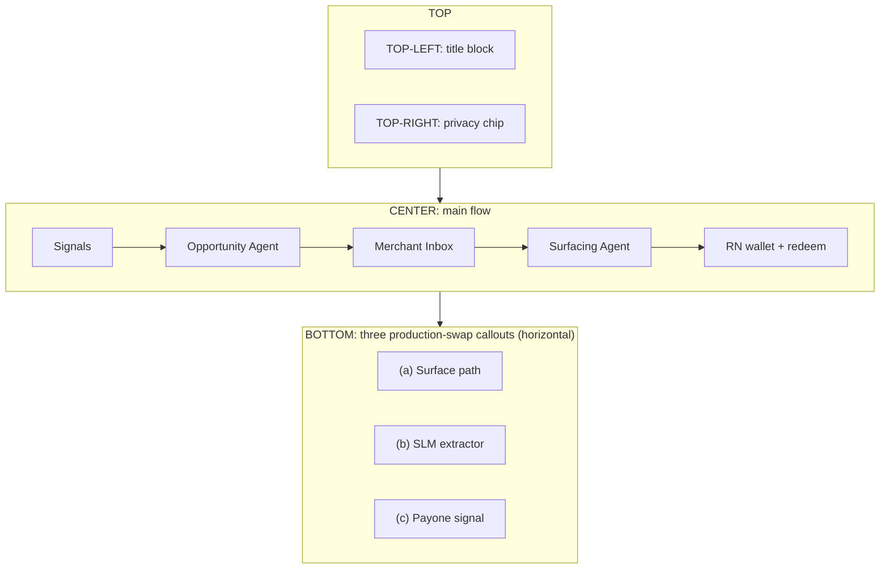
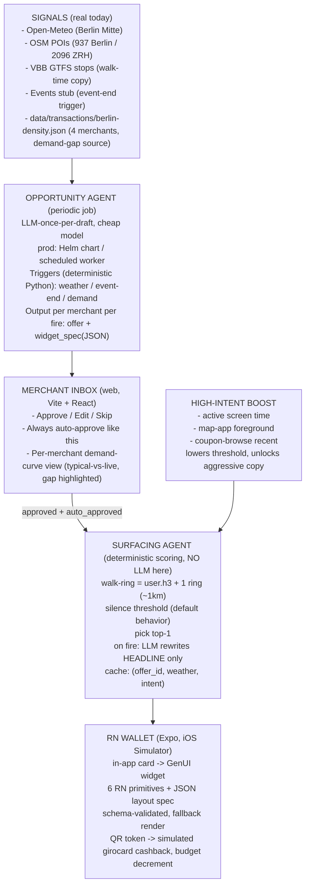
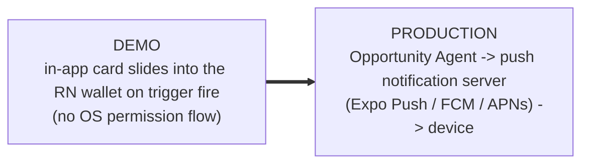
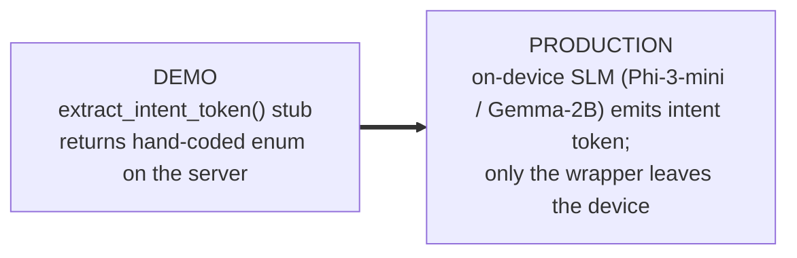
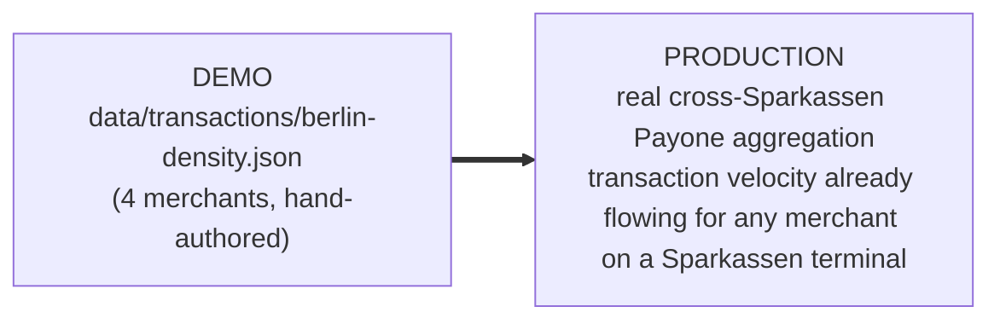

# Architecture Slide Source

Source copy for the ≤60-second tech-video architecture slide. Hand-render in
Excalidraw / Figma / slide tool, or compile to image. Visual language follows
the OpenAI-demo pattern: clean main flow + three "production swap" callouts in
a consistent style. Aligned to `spec-v04` and `context/AGENT_IO.md`.

## Title

**MomentMarkt — generated local offers, governed by context**

Subtitle: *Two agents. Three triggers. One quiet wallet.*

## Canvas layout (16:9)



## Main flow (top half of slide)



## Two-agent split annotation (callout block beside the agents)

> **Opportunity Agent** — periodic, per-merchant. Drafts `{offer, widget_spec}`
> from the three triggers. Writes to merchant inbox.
>
> **Surfacing Agent** — real-time, per-user. Deterministic scoring with
> high-intent boost. LLM is invoked **only** for headline rewrite on the one
> card that fires.
>
> Each agent calls the LLM at most once per output. Scoring and trigger logic
> stay in deterministic Python.

## Privacy boundary chip (top-right of slide, near the wallet)

```json
{
  "intent_token": "lunch_break.cold",
  "h3_cell_r8":   "881f1d489dfffff",
  "weather_state": "rain_incoming",
  "t": 1714060200,
  "high_intent": {
    "active_screen_time_recent_s": 47,
    "map_app_foreground_recent": true,
    "coupon_browse_recent": false
  }
}
```

Caption beneath the chip: *Only this wrapper crosses the boundary. Raw GPS,
dwell history, redemption history, and full preference profile stay on device
in the production architecture.*

## Three "production swap" callouts (bottom strip, horizontal)

Render each as an identical card: demo state on the left, arrow, production
state on the right. Same visual treatment for all three — that consistency is
the whole pitch beat.

### (a) Surface path



### (b) SLM extractor (intent token)



### (c) Payone signal (demand)



## Aggregate-intelligence callout (bottom-right corner, 10-second pitch beat)

> **Cross-merchant pattern learning.** Once N merchants are on the platform,
> the Opportunity Agent learns patterns no single merchant sees — e.g.
> *"bakeries in 8001 Zürich consistently lose 22% of Monday-morning traffic; a
> pre-10am offer recovers ~60%."* DSV-Gruppe already aggregates across
> thousands of Sparkassen — this is the data network effect a consumer-AI
> startup cannot replicate.

## On-stage speaker note (one line)

> "For the demo we show the seams: synthetic Payone density, server-side
> intent, in-app surfacing. In production those swap to real Payone
> aggregation, on-device SLM, and real push delivery — without changing the
> two-agent loop, the GenUI contract, or the privacy wrapper."

## Why DSV / Why Payone (single sentence each, for Q&A handling)

- **Why DSV.** Three things only DSV-Gruppe brings: Payone for the demand
  signal, the Sparkasse rail for redemption and trust, and the existing
  S-Markt & Mehrwert merchant relationships — the supply side a consumer AI
  startup cannot build.
- **Why Payone.** For the merchants Sparkassen already acquire, transaction
  velocity is observable in real time at zero onboarding cost; today we
  simulate it, and the production swap is a config change, not an architecture
  change.

## Render checklist before exporting the slide

- [ ] Title + subtitle present (top-left)
- [ ] Main flow visible left-to-right with both agent boxes labelled
- [ ] Opportunity Agent annotated `«periodic job — Helm chart / scheduled worker in prod»`
- [ ] High-intent boost arrow drawn explicitly into the Surfacing Agent
- [ ] Privacy-boundary chip rendered top-right with the JSON visible
- [ ] Three production-swap callouts at bottom in identical visual style
- [ ] Aggregate-intelligence callout in bottom-right corner
- [ ] No Sparkassen branding in the wallet UI artwork (neutral palette)
- [ ] Three datasets named on screen: Open-Meteo, OSM/Overpass, VBB GTFS
- [ ] `berlin-density.json` and `cities/zurich.yaml` named on screen
- [ ] Exports cleanly at 1920×1080 (16:9) for the tech video
